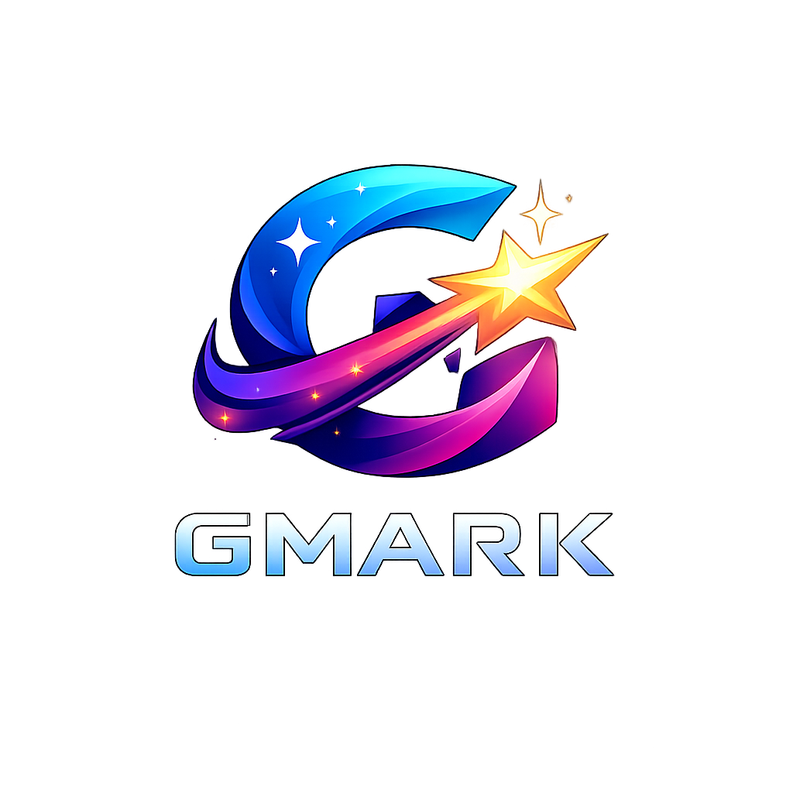

<div align="center">
  
  
  # GMarks - Intelligent Bookmark Manager
  
  **🚀 AI-powered browser extension for intelligent bookmark classification and management**
  
  [](https://chrome.google.com)
  [](LICENSE)
  [](https://github.com/afeldman/gmark/pulls)
  
</div>

---

## 📖 Übersicht

GMarks ist eine intelligente Browser-Extension, die deine Bookmarks automatisch mit KI klassifiziert, organisiert und durchsuchbar macht. Mit lokaler Chrome Prompt API und Cloud-AI-Providern für maximale Flexibilität und Privacy.

### ✨ Hauptfeatures

- 🤖 **AI-Klassifikation** - Automatische Kategorisierung mit 9 intelligenten Kategorien
- 🔒 **Privacy First** - Lokale Chrome Prompt API (on-device)
- ☁️ **Cloud Providers** - OpenAI, DeepSeek, Gemini, Mistral, Llama
- 📊 **Live Dashboard** - Moderne UI mit Echtzeit-Charts und Statistiken
- 🔍 **Smart Search** - Volltextsuche mit Kategoriefiltern
- 🏷️ **Auto-Tagging** - Intelligente Tag-Generierung
- 📱 **Responsive Design** - Dark Theme mit Glassmorphism-Effekten
- 🔄 **Bootstrap System** - Automatische Kategorisierung aller bestehenden Bookmarks
- 🎯 **Pattern Matching** - Schnelle Offline-Klassifikation

## 🚀 Installation

### Voraussetzungen

- Google Chrome 130+ oder Chromium-basierter Browser
- Node.js 18+ (für Entwicklung)

### Browser Extension

1. **Repository klonen**

   ```bash
   git clone https://github.com/afeldman/gmark.git
   cd gmark/browser-extension-local
   ```

2. **Extension laden**

   - Öffne Chrome: `chrome://extensions/`
   - Aktiviere "Entwicklermodus" (oben rechts)
   - Klicke "Entpackte Erweiterung laden"
   - Wähle den `browser-extension-local` Ordner

3. **Setup**
   - Klicke auf das GMarks Icon
   - Öffne Einstellungen
   - Wähle AI Provider (Chrome Prompt API oder Cloud)
   - Bei Cloud: API-Key eingeben

## 📚 Kategorien

GMarks klassifiziert Bookmarks in 9 intelligente Kategorien:

| Kategorie         | Icon | Beschreibung                      | Farbe     |
| ----------------- | ---- | --------------------------------- | --------- |
| **Development**   | 💻   | Code, APIs, GitHub, StackOverflow | `#4f46e5` |
| **Social**        | 👥   | Social Media, Communities         | `#ec4899` |
| **News**          | 📰   | Nachrichten, Blogs, Artikel       | `#f59e0b` |
| **Shopping**      | 🛍️   | E-Commerce, Produkte              | `#10b981` |
| **Education**     | 📚   | Kurse, Tutorials, Lernen          | `#8b5cf6` |
| **Entertainment** | 🎬   | Filme, Musik, Games, Streaming    | `#f43f5e` |
| **Documentation** | 📖   | Docs, Guides, Referenzen          | `#06b6d4` |
| **Tools**         | 🔧   | Online-Tools, Utilities           | `#64748b` |
| **Other**         | 📌   | Sonstiges                         | `#6b7280` |

## 🛠️ Architektur

### Tech Stack

```
Frontend:          HTML5, CSS3, JavaScript (ES6+)
AI/ML:             Chrome Prompt API, OpenAI, DeepSeek, Gemini
Storage:           IndexedDB, Chrome Storage API
Charts:            Custom Canvas-based SimpleChart (Manifest V3)
Build:             Chrome Extension Manifest V3
```

### Komponenten

```
browser-extension-local/
├── src/
│   ├── background.js          # Service Worker
│   ├── content.js             # Content Script
│   ├── services/
│   │   ├── classification.js  # AI Klassifikation
│   │   ├── bootstrap.js       # Batch-Processing
│   │   └── ai-provider.js     # Cloud AI Integration
│   ├── ui/
│   │   ├── popup.html/js/css  # Extension Popup
│   │   ├── dashboard.html     # Vollbild Dashboard
│   │   └── options.html       # Einstellungen
│   ├── utils/
│   │   ├── storage.js         # IndexedDB Manager
│   │   ├── simple-charts.js   # Canvas Charts
│   │   └── logger.js          # Debug Logging
│   └── types/
│       └── ai.js              # Chrome Prompt API Types
├── icons/                      # Extension Icons
└── manifest.json               # Chrome Extension Config
```

## 🎯 Verwendung

### Bookmark speichern

1. **Schnellspeichern**: Klicke Extension-Icon → "Aktuelle Seite speichern"
2. **Mit KI**: Automatische Klassifikation mit HTML-Content-Analyse
3. **Tags**: Auto-generierte Tags basierend auf Content

### Dashboard

- **Statistiken**: Gesamte Bookmarks, Kategorien, Duplikate
- **Charts**:
  - 7-Tage Aktivität (Line Chart)
  - Kategorieverteilung (Doughnut Chart)
- **Activity Stream**: Letzte 5 gespeicherte Bookmarks
- **Auto-Refresh**: Alle 30 Sekunden

### Suche & Filter

- Volltextsuche über Titel, URL, Tags
- Kategoriefilter
- Sortierung: Datum, Titel, Confidence

## 🤖 AI Provider

### Chrome Prompt API (lokal)

```javascript
// Aktivieren in Einstellungen
- 100% Privacy (on-device)
- Keine API-Kosten
- Offline verfügbar
- Chrome 130+ erforderlich
```

### Cloud Providers

| Provider            | Modell           | API Key erforderlich |
| ------------------- | ---------------- | -------------------- |
| OpenAI              | GPT-4o-mini      | ✅                   |
| DeepSeek            | deepseek-chat    | ✅                   |
| Google Gemini       | gemini-1.5-flash | ✅                   |
| Mistral AI          | mistral-small    | ✅                   |
| Together AI (Llama) | Meta-Llama       | ✅                   |
| Ollama              | local            | ❌                   |
| LM Studio           | local            | ❌                   |

## 📊 Features im Detail

### Klassifikation

**Hybrid-Ansatz:**

1. **Pattern Matching** - Schnelle Offline-Klassifikation via URL/Titel-Patterns
2. **AI Klassifikation** - Tiefe Content-Analyse mit HTML Body (2000 Zeichen)
3. **Confidence Scoring** - 5 Dezimalstellen Genauigkeit (0.3 - 0.9)

**HTML Content Integration:**

```javascript
// Extrahiert erste 2000 Zeichen des HTML Body
const bodyContent = bookmark.content?.substring(0, 2000);
// Übergibt an AI für bessere Klassifikation
```

### Bootstrap System

- ⚡ **Concurrent Processing** - Verhindert Einstellungsänderungen während Bootstrap
- 📈 **Progress Tracking** - Live-Status in Einstellungen
- 🔄 **Resume Capability** - Fortsetzung bei Unterbrechung
- 🎯 **Batch Classification** - Effiziente Bulk-Verarbeitung

### Storage

- **IndexedDB**: Hauptspeicher für Bookmarks (unbegrenzte Größe)
- **Chrome Storage**: Einstellungen, Provider-Configs
- **Kategorie-Ordner**: Auto-Setup beim Start

## 🎨 UI/UX

### Popup

```
Modern Dark Theme (#0f172a)
├── Gradient Header (Purple)
├── Hero Stats (Bookmarks, Kategorien, Duplikate)
├── Live Charts
│   ├── Activity (7 Tage)
│   └── Categories (Top 5)
├── Recent Activity Stream
└── Quick Actions
```

### Charts

**SimpleChart Library** (Manifest V3 kompatibel):

- Line Charts mit Gradient Fill
- Doughnut Charts mit Legend
- Canvas-basiert (kein externes CDN)
- Responsive mit devicePixelRatio-Support

## 🔐 Privacy & Security

- ✅ **Lokale Verarbeitung** - Chrome Prompt API läuft on-device
- ✅ **Keine Tracker** - Kein Analytics, keine Telemetrie
- ✅ **Opt-in Cloud** - Cloud-Provider nur auf Wunsch
- ✅ **Encrypted Storage** - IndexedDB mit Chrome Security
- ✅ **Manifest V3** - Neueste Chrome Security Standards

## 🚧 Entwicklung

### Setup

```bash
cd browser-extension-local
# Keine Build-Tools erforderlich - Pure JavaScript
```

### Debugging

```javascript
// Logger aktivieren in background.js
logger.setLevel('debug');

// Console öffnen
chrome://extensions → GMarks → Background Service Worker
```

### Testing

```bash
# Manuelle Tests
1. Bookmark speichern
2. Dashboard öffnen
3. Klassifikation prüfen
4. Charts validieren
```

## 📝 Changelog

### v1.0.0 (Aktuell)

- ✨ Initial Release
- 🤖 AI-Klassifikation (Chrome Prompt API + 7 Cloud Provider)
- 📊 Live Dashboard mit Charts
- 🔍 Smart Search & Filter
- 🏷️ Auto-Tagging
- 🎨 Modern Dark Theme UI
- 🔄 Bootstrap System
- 📱 Responsive Design

## 🤝 Contributing

Contributions sind willkommen!

1. Fork das Projekt
2. Erstelle Feature Branch (`git checkout -b feature/AmazingFeature`)
3. Commit Changes (`git commit -m 'Add AmazingFeature'`)
4. Push to Branch (`git push origin feature/AmazingFeature`)
5. Öffne Pull Request

## 📄 Lizenz

Distributed under the MIT License. See `LICENSE` for more information.

## 👤 Autor

**Anton Feldmann** - [@afeldman](https://github.com/afeldman)

## � Support & Sponsorship

Wenn dir GMarks gefällt und du das Projekt unterstützen möchtest:

**Ethereum (ETH) Sponsorship:**

```
0xDc1075fc8D4523567b8dfcBD2EBeDb25440fE196
```

[](https://etherscan.io/address/0xDc1075fc8D4523567b8dfcBD2EBeDb25440fE196)

Deine Unterstützung hilft bei der Weiterentwicklung von GMarks! 🚀

## �🙏 Acknowledgments

- Chrome Prompt API Team
- OpenAI, DeepSeek, Google, Mistral, Meta AI
- Chrome Extension Developer Community

---

<div align="center">
  Made with ❤️ and 🤖 by Anton Feldmann
  
  **[⭐ Star this repo](https://github.com/afeldman/gmark)** if you find it useful!
</div>
